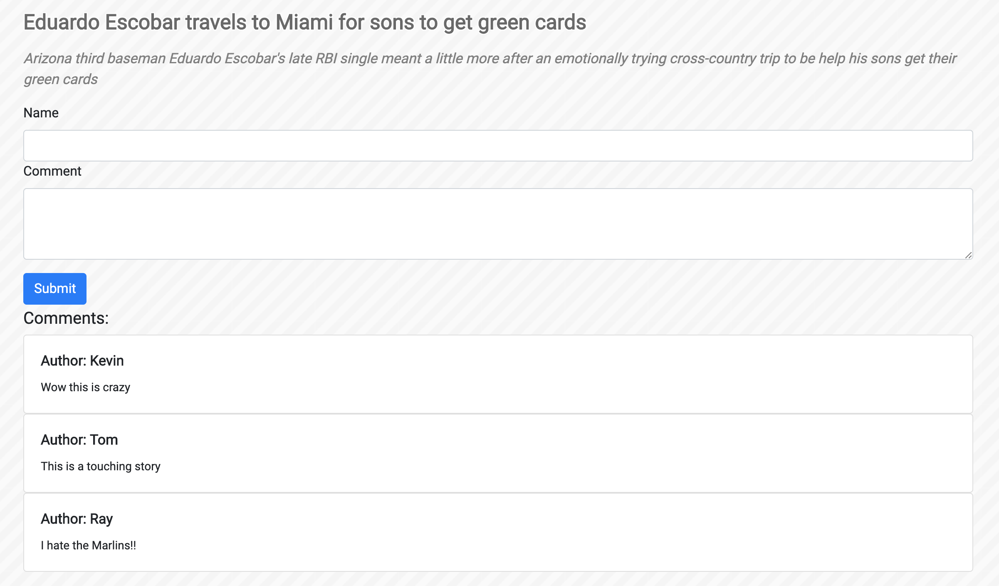
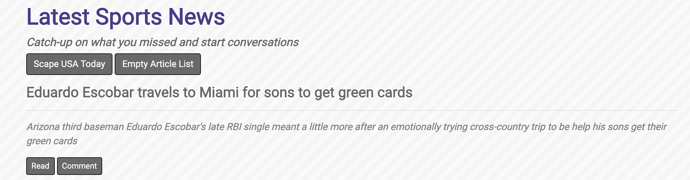

# News-Scraper

## Overview
Mongo Scraper - USA Today Sports Edition.

A full stack app that scrapes articles from USA Today's sports section. Users are able to read an comment about on the articles.

### Screenshots
Home page shows the latest sports news with the options to empty the database or to refresh the scrape. On each article you can read, which links to the article on a new tab in the browser, or comment, which brings the user to a page made for discussion about the article.
 
  
 
Example of the comment page:
 

## Technologies
* MongoDB, Express, NodeJS.
* npm: axios, cheerio, handlebars, body-parser, mongojs.
* jQuery, Bootstrap.

## Deployed Link
https://shrouded-spire-95120.herokuapp.com/articles

## Future Oportunities
* Plenty of styling adjustments that could me made if allowed more time
* I'd like to incorporate a 'Favorites' function for users to save articles
* Would like to grab images as well
